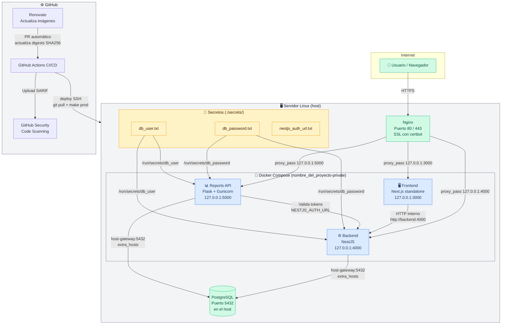

# ARCHITECTURE.md — Arquitectura del proyecto NOMBRE_DEL_PROYECTO

> Diagrama oficial de la infraestructura. Actualizar al añadir nuevos servicios o componentes.
>
> **Última actualización:** Febrero 2026

---

## Diagrama de arquitectura



---

## Descripción de componentes

### Servicios Docker (red `nombre_del_proyecto-private`, `internal: true`)

| Servicio | Tecnología | Puerto | Imagen base | Recursos prod |
|---|---|---|---|---|
| `backend` | NestJS + Node.js 24 | 4000 | `node:24-slim` | 1 CPU / 1GB RAM |
| `frontend` | Next.js 24 standalone | 3000 | `node:24-slim` | 0.5 CPU / 512MB RAM |
| `reports-api` | Flask + Gunicorn (gthread) | 5000 | `python:3.12-slim` | 2 CPU / 2GB RAM |

### Infraestructura en el host (fuera de Docker)

| Componente | Motivo de no dockerizar |
|---|---|
| **Nginx** | Gestiona SSL/TLS, certbot, múltiples dominios — responsabilidad del servidor |
| **PostgreSQL** | Datos críticos con acceso directo a disco, backups más simples, experiencia operativa del equipo |

Ver `DECISIONS.md ADR-006` para la justificación detallada.

---

## Flujo de red en producción

```
Internet
  ↓ HTTPS (443)
Nginx (host)
  ↓ proxy_pass 127.0.0.1:3000/4000/5000
Servicios Docker (solo accesibles desde localhost)
  ↓ red nombre_del_proyecto-private (internal: true)
  ↓ extra_hosts: host-gateway → IP del host
PostgreSQL (host:5432)
```

**Seguridad de red:**
- Los puertos están bound a `127.0.0.1` — ningún servicio es accesible directamente desde internet
- La red Docker es `internal: true` — los contenedores no tienen acceso a internet
- Solo Nginx (en el host) actúa como reverse proxy y punto de entrada

---

## Flujo de tráfico de una request típica

```
1. Navegador → https://tudominio.com          (Nginx)
2. Nginx     → http://127.0.0.1:3000         (Frontend Next.js)
3. Frontend  → http://127.0.0.1:4000/api/... (Backend NestJS)   [desde navegador]
   o
3. Frontend  → http://backend:4000/api/...   (Backend NestJS)   [desde SSR del servidor]
4. Backend   → host-gateway:5432             (PostgreSQL)
```

---

## Flujo de seguridad (CI/CD)

```
PR abierto
  → security.yml: hadolint (lint Dockerfiles)
  → security.yml: trivy fs scan (SARIF → GitHub Security)

Push a main / PR
  → ci.yml validate: compose config + make validate-env
  → ci.yml build: imágenes prod × 3
  → ci.yml test: backend + frontend + reports
  → ci.yml sbom: CycloneDX × 3 (retención 90 días)
  → ci.yml scan: trivy image × 3 (SARIF → GitHub Security)

Push de tag v*.*.*
  → deploy.yml: SSH → git pull → make prod
```

---

## Diagrama de flujo de datos sensibles

```
secrets/db_password.txt (chmod 600, .gitignored)
  ↓ montado como
/run/secrets/db_password (dentro del contenedor, read-only)
  ↓ leído por la app
fs.readFileSync('/run/secrets/db_password').trim()  (Node.js)
open('/run/secrets/db_password').read().strip()      (Python)
  ↓ usado en
conexión a PostgreSQL (nunca pasa por variables de entorno visibles)
```

---

## Dependencias por servicio

```
Backend (NestJS)
├── Node.js 24 (LTS)
├── TypeScript → compilado a dist/ en el build
├── @nestjs/core, @nestjs/platform-express
├── @nestjs/terminus (pendiente — healthcheck DB)
└── TypeORM / pg driver

Frontend (Next.js)
├── Node.js 24 (LTS)
├── Next.js (output: standalone)
└── React 18

Reports API (Flask)
├── Python 3.12
├── Flask 2.x
├── Gunicorn (gthread, 4 threads, timeout 300s)
├── pandas, openpyxl (procesamiento Excel)
├── psycopg2 (conexión PostgreSQL)
└── gunicorn wheels precompiladas en builder stage

Infraestructura
├── Docker Compose v2
├── Makefile (GNU make)
├── GitHub Actions
├── Renovate (actualización automática)
├── hadolint (lint Dockerfiles)
├── trivy (vulnerability scan + misconfig)
├── syft (SBOM CycloneDX)
└── grype (vulnerability scan alternativo)
```
