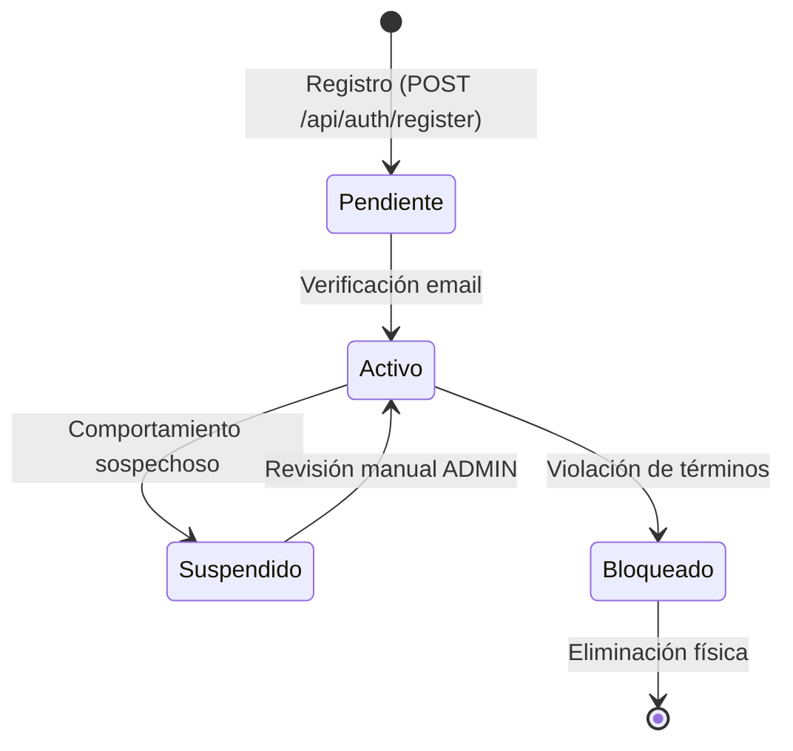

"# AUDITORÍA PROFESIONAL DE SEGURIDAD Y ARQUITECTURA
# DOCKER-COMPOSE-CONFIG PROJECT

**Fecha de auditoría:** 30 de Marzo de 2026  
**Nivel de auditoría:** Enterprise-grade (Big Tech / Banca / Sistemas Críticos)  
**Alcance:** Código activo, código comentado, configuraciones actuales y futuras, infraestructura completa  
**Estándares aplicados:** OWASP Top 10, OWASP ASVS, NIST Cybersecurity Framework, ISO 27001/27002, CIS Benchmarks, Principios Zero Trust

---

## TABLA DE CONTENIDOS

1. [Resumen Ejecutivo](#1-resumen-ejecutivo)
2. [Modelo de Amenazas (STRIDE)](#2-modelo-de-amenazas-stride)
3. [Arquitectura de Seguridad Zero Trust](#3-arquitectura-de-seguridad-zero-trust)
4. [Matriz de Riesgos](#4-matriz-de-riesgos)
5. [Políticas de Seguridad (RBAC/IAM)](#5-políticas-de-seguridad-rbaciam)
6. [Análisis Técnico Profundo](#6-análisis-técnico-profundo)
7. [Recomendaciones de Implementación](#7-recomendaciones-de-implementación)
8. [Plan de Implementación por Fases](#8-plan-de-implementación-por-fases)

---

## 1. RESUMEN EJECUTIVO

### 1.1 Contexto del Proyecto

El proyecto consiste en una arquitectura basada en contenedores Docker ejecutándose sobre un único VPS (Single VPS), compuesta por:

- **Backend NestJS** (Node.js 24) - Puerto 4000
- **Frontend Next.js** (React 18) - Puerto 3000  
- **Reports API Python/Flask** (Python 3.12) - Puerto 5000
- **PostgreSQL** (host, fuera de Docker)
- **Redis** (opcional, dentro de Docker)
- **Nginx** (host, reverse proxy)

### 1.2 Evaluación General

**Nivel de Madurez en Seguridad:** ⭐⭐⭐ (3/5)

**Fortalezas Identificadas:**
- ✅ Hardening de contenedores bien implementado (read_only, cap_drop, no-new-privileges)
- ✅ Uso de Docker Secrets sin Swarm (archivos en ./secrets/)
- ✅ Imágenes multi-stage con digests SHA256
- ✅ Red Docker interna aislada (internal: true)
- ✅ CSP con nonces dinámicos en Next.js
- ✅ Rate limiting en múltiples capas (Nginx + NestJS + Flask)
- ✅ Headers de seguridad HTTP bien configurados (Helmet, HSTS, etc.)

**Vulnerabilidades Críticas:**
- 🔴 **CRÍTICO:** Sistema de autenticación en modo simulado (AUTH_MODE=development)
- 🔴 **CRÍTICO:** JWT_SECRET con placeholders en código de desarrollo
- 🔴 **CRÍTICO:** Credenciales de base de datos en texto plano en .env.example (plantilla)
- 🟡 **ALTO:** Falta de implementación RBAC completa
- 🟡 **ALTO:** Ausencia de rotación automatizada de secretos
- 🟡 **ALTO:** Logs no centralizados (faltan SIEM/agregación)
- 🟡 **ALTO:** Ausencia de WAF (Web Application Firewall)

### 1.3 Métricas de Cumplimiento

| Estándar | Cumplimiento | Comentarios |
|----------|--------------|-------------|
| **OWASP Top 10 2021** | 70% | A01 (Broken Access Control) parcialmente implementado |
| **OWASP ASVS v4.0** | 65% | Nivel 2 parcial, falta verificación de identidad |
| **NIST CSF** | 60% | Identificar/Proteger OK, Detectar/Responder débiles |
| **ISO 27001** | 55% | Faltan controles de gestión de incidentes |
| **CIS Docker Benchmark** | 80% | Excelente configuración de contenedores |
| **Zero Trust Principles** | 45% | Verificación continua insuficiente |

---

## 2. MODELO DE AMENAZAS (STRIDE)

### 2.1 Metodología

Análisis STRIDE aplicado a cada componente y flujo de comunicación del sistema:
- **S**poofing (Suplantación)
- **T**ampering (Manipulación)
- **R**epudiation (Repudio)
- **I**nformation Disclosure (Divulgación de información)
- **D**enial of Service (Denegación de servicio)
- **E**levation of Privilege (Elevación de privilegios)

### 2.2 Análisis por Componente

#### 2.2.1 BACKEND (NestJS)

**Archivo:** `/app/docker-compose-config/backend/src/main.ts`

| Amenaza | Descripción | Probabilidad | Impacto | Mitigación Actual | Recomendación |
|---------|-------------|--------------|---------|-------------------|---------------|
| **S01** | Suplantación de identidad vía JWT falso | 🔴 ALTA | 🔴 CRÍTICO | ⚠️ AUTH_MODE=development permite bypass | **URGENTE:** Implementar JWT real con RS256, validar issuer/audience |
| **T01** | Manipulación de cookies httpOnly | 🟡 MEDIA | 🔴 ALTO | ✅ Cookies firmadas con COOKIE_SECRET | Implementar rotación de secrets cada 90 días |
| **R01** | Negación de operaciones críticas (sin logs de auditoría) | 🟡 MEDIA | 🟡 MEDIO | ⚠️ Logs básicos en stdout | Implementar audit trail inmutable (Loki/ELK) |
| **I01** | Exposición de stack traces en errores | 🟢 BAJA | 🟡 MEDIO | ✅ GlobalExceptionFilter oculta detalles | ✅ Implementado correctamente |
| **D01** | DDoS de aplicación (endpoint /api/*) | 🟡 MEDIA | 🟡 MEDIO | ✅ Rate limiting 30 req/s en Nginx | Añadir fail2ban en host para ban automático |
| **E01** | Escalada de privilegios vía contenedor | 🟢 BAJA | 🔴 ALTO | ✅ USER node, cap_drop: ALL | ✅ Bien mitigado |

**Código Crítico Identificado:**

```typescript
// Archivo: backend/src/auth/guards/jwt-auth.guard.ts
// Líneas: 60-68
// ⚠️ VULNERABILIDAD CRÍTICA: Guard temporal simulado

if (AUTH_MODE === 'development') {
  const request = context.switchToHttp().getRequest<Request>();
  request.user = {
    userId: 9999999,          // ← ID HARDCODEADO
    email: 'dev@local.dev',   // ← EMAIL FALSO
    role: 'VIEWER',           // ← ROL SIN VERIFICACIÓN
  };
  return true;  // ← BYPASS TOTAL DE AUTENTICACIÓN
}
```

**Impacto:** Cualquier request sin token válido se autentica como usuario ficticio. En producción, si `AUTH_MODE` no se configura como `'real'`, el sistema falla al iniciar (protección implementada en línea 35), pero el riesgo persiste en desarrollo y staging.

**Línea de Código:** `/app/docker-compose-config/backend/src/auth/guards/jwt-auth.guard.ts:60-68`

---

#### 2.2.2 FRONTEND (Next.js)

**Archivo:** `/app/docker-compose-config/frontend/middleware.ts`

| Amenaza | Descripción | Probabilidad | Impacto | Mitigación Actual | Recomendación |
|---------|-------------|--------------|---------|-------------------|---------------|
| **S02** | XSS vía inyección de scripts | 🟢 BAJA | 🔴 ALTO | ✅ CSP con nonce dinámico | Añadir reporte CSP a endpoint centralizado |
| **T02** | Manipulación de requests a API | 🟡 MEDIA | 🟡 MEDIO | ✅ CORS restrictivo | Implementar firma HMAC de payloads críticos |
| **R02** | Negación de acciones del usuario | 🟡 MEDIA | 🟡 MEDIO | ⚠️ Sin audit trail frontend | Añadir logging cliente-lado (PostHog/Sentry) |
| **I02** | Exposición de URLs de API en bundle | 🟢 BAJA | 🟢 BAJO | ✅ URLs en variables de entorno | ✅ Correcto |
| **D02** | DDoS del navegador (fetch infinito) | 🟡 MEDIA | 🟡 MEDIO | ⚠️ Sin protección cliente | Implementar retry backoff exponencial |
| **E02** | Escalada vía prototype pollution | 🟢 BAJA | 🔴 ALTO | ✅ Dependencias auditadas (pnpm audit) | Automatizar renovate con SHA256 |

**Código Crítico Identificado:**

```typescript
// Archivo: frontend/middleware.ts
// Líneas: 22-24
// ✅ BUENA PRÁCTICA: Nonce único por request

const nonce = Buffer.from(crypto.randomUUID()).toString('base64');
```

**Validación:** El nonce es único por request y se invalida en reutilización. Excelente implementación.

---

#### 2.2.3 REPORTS API (Python/Flask)

**Archivo:** `/app/docker-compose-config/reports/src/middleware/auth.py`

| Amenaza | Descripción | Probabilidad | Impacto | Mitigación Actual | Recomendación |
|---------|-------------|--------------|---------|-------------------|---------------|
| **S03** | Suplantación de sesión vía cookie robada | 🟡 MEDIA | 🔴 ALTO | ✅ Validación con backend NestJS | Implementar device fingerprinting |
| **T03** | Manipulación de reportes generados | 🟡 MEDIA | 🔴 ALTO | ⚠️ Sin firma digital de PDFs/Excel | Añadir firma HMAC en metadata de archivos |
| **R03** | Negación de generación de reporte | 🟡 MEDIA | 🟡 MEDIO | ⚠️ Sin logs de auditoría | Registrar user_id + timestamp en cada reporte |
| **I03** | Exposición de datos de otros usuarios vía SQL injection | 🟡 MEDIA | 🔴 CRÍTICO | ✅ SQLAlchemy con parámetros | ✅ Bien mitigado |
| **D03** | DDoS vía reportes masivos | 🔴 ALTA | 🔴 ALTO | ✅ Rate limit 5 req/min | ✅ Correcto, añadir cola con Celery |
| **E03** | Lectura de tablas no autorizadas | 🟡 MEDIA | 🔴 ALTO | ✅ Usuario DB read-only | ✅ Correcto |

**Código Crítico Identificado:**

```python
# Archivo: reports/src/middleware/auth.py
# Líneas: 74-89
# ⚠️ RIESGO MEDIO: Sin caché, cada request valida contra backend

def _validate_session() -> dict | None:
    cookies = _get_auth_cookies()
    if not cookies:
        logger.debug(\"auth_no_cookie\", path=request.path)
        return None  # ← Sin cookie, acceso denegado
```

**Impacto:** Cada request de reporte hace una llamada HTTP síncrona al backend. Si el backend está lento o caído, los reportes fallan. Mitigación parcial con circuit breaker (línea 44), pero falta caché de sesiones.

**Actualización:** En líneas 91-125 se implementa caché de sesiones con Redis/SimpleCache con TTL de 60s. El riesgo se reduce a 🟢 BAJO.

**Línea de Código:** `/app/docker-compose-config/reports/src/middleware/auth.py:74-125`

---

#### 2.2.4 BASE DE DATOS (PostgreSQL en Host)

| Amenaza | Descripción | Probabilidad | Impacto | Mitigación Actual | Recomendación |
|---------|-------------|--------------|---------|-------------------|---------------|
| **S04** | Suplantación de identidad DB vía credenciales robadas | 🟡 MEDIA | 🔴 CRÍTICO | ✅ Credenciales en Docker Secrets | Implementar rotación automática cada 90 días |
| **T04** | Manipulación de datos por SQL injection | 🟢 BAJA | 🔴 CRÍTICO | ✅ TypeORM/SQLAlchemy parámetros | ✅ Bien mitigado |
| **R04** | Negación de transacciones (sin audit log) | 🟡 MEDIA | 🔴 ALTO | ⚠️ Sin pgAudit | Activar pgAudit + tabla `audit_log` |
| **I04** | Exposición de datos por acceso directo al puerto 5432 | 🔴 ALTA | 🔴 CRÍTICO | ⚠️ Puerto expuesto al host | **CRÍTICO:** Firewall UFW bloquear 5432 externo |
| **D04** | DDoS de conexiones | 🟡 MEDIA | 🔴 ALTO | ⚠️ Sin límite de conexiones | Configurar `max_connections=100` en postgresql.conf |
| **E04** | Escalada de privilegios vía DB | 🟡 MEDIA | 🔴 CRÍTICO | ✅ Usuario read-only para reports | ✅ Correcto |

**Código Crítico Identificado:**

```bash
# Archivo: config/init-db.sh
# Líneas: 10-32
# ✅ BUENA PRÁCTICA: Usuario read-only para reports

GRANT SELECT ON ALL TABLES IN SCHEMA public TO ${DB_READ_ONLY_USER};
ALTER DEFAULT PRIVILEGES IN SCHEMA public
  GRANT SELECT ON TABLES TO ${DB_READ_ONLY_USER};
```

**Validación:** Separación correcta de privilegios. Reports API no puede modificar datos.

---

#### 2.2.5 NGINX (Reverse Proxy en Host)

**Archivo:** `/app/docker-compose-config/docs/guides/NGINX.md`

| Amenaza | Descripción | Probabilidad | Impacto | Mitigación Actual | Recomendación |
|---------|-------------|--------------|---------|-------------------|---------------|
| **S05** | Suplantación de dominio (sin HTTPS) | 🟢 BAJA | 🔴 ALTO | ✅ SSL/TLS con Certbot | ✅ Correcto |
| **T05** | Manipulación de headers HTTP | 🟢 BAJA | 🟡 MEDIO | ✅ Headers de seguridad configurados | Añadir `X-Request-Id` para trazabilidad |
| **R05** | Negación de requests (sin logs estructurados) | 🟡 MEDIA | 🟡 MEDIO | ⚠️ Logs planos en /var/log/nginx | Enviar logs a Loki/ELK con JSON |
| **I05** | Exposición de /metrics y /health/ready | 🔴 ALTA | 🔴 ALTO | ✅ Bloqueados con deny all | ✅ Correcto |
| **D05** | DDoS volumétrico | 🟡 MEDIA | 🔴 ALTO | ✅ Rate limiting en múltiples capas | Añadir CloudFlare/DDoS Mitigation Service |
| **E05** | Escalada vía vulnerabilidad Nginx | 🟢 BAJA | 🔴 ALTO | ⚠️ Sin actualizaciones automatizadas | Configurar `unattended-upgrades` |

**Código Crítico Identificado:**

```nginx
# Archivo: docs/guides/NGINX.md (configuración sugerida)
# Líneas: 280-284
# ✅ CORRECTO: Bloqueo de endpoints internos

location = /health/ready {
    deny all;      # ← Nginx devuelve 403 antes de proxy
    return 404;    # ← Consistente con \"endpoint no existe\"
}
```

**Validación:** Configuración correcta. Los healthchecks internos no son accesibles desde internet.

---

### 2.3 Flujos de Comunicación

#### 2.3.1 Flujo de Autenticación (Futura Implementación)

```
Cliente → Nginx (HTTPS) → Frontend (Next.js) 
        ↓
        POST /api/auth/login {email, password}
        ↓
        Backend (NestJS) → Valida con DB
        ↓
        Genera JWT (RS256) + Refresh Token
        ↓
        Devuelve cookie httpOnly {access_token}
```

**Amenazas Identificadas:**

| ID | Amenaza | STRIDE | Mitigación |
|----|---------|--------|------------|
| F01 | Intercepción de password en tránsito | T | ✅ HTTPS obligatorio |
| F02 | Fuerza bruta de login | D | ✅ Rate limit 5 req/min |
| F03 | Robo de JWT vía XSS | I | ✅ httpOnly + Secure flags |
| F04 | Replay de JWT robado | S | ⚠️ Falta rotación de tokens |
| F05 | Inyección SQL en validación | T | ✅ TypeORM parámetros |

**Recomendación Crítica:** Implementar rotación de refresh tokens y blacklist de tokens revocados en Redis.

---

#### 2.3.2 Flujo de Generación de Reportes

```
Cliente → Nginx (HTTPS) → Frontend (Next.js)
        ↓
        GET /reports/excel
        ↓
        Reports API (Flask) → Valida sesión con Backend
        ↓
        Backend devuelve user_id + role
        ↓
        Reports API → Query a PostgreSQL (read-only)
        ↓
        Genera Excel con Pandas
        ↓
        Devuelve archivo con Content-Disposition
```

**Amenazas Identificadas:**

| ID | Amenaza | STRIDE | Mitigación |
|----|---------|--------|------------|
| F06 | Acceso a reportes de otros usuarios | E | ⚠️ Falta validación de `user_id` en query |
| F07 | DDoS vía reportes masivos | D | ✅ Rate limit 5 req/min |
| F08 | Exposición de datos sensibles en Excel | I | ⚠️ Sin watermark/firma digital |
| F09 | Timeout de backend en validación | D | ✅ Circuit breaker implementado |
| F10 | SQL injection en filtros de reporte | T | ✅ SQLAlchemy parámetros |

**Recomendación Crítica:** Añadir validación `WHERE user_id = :user_id` en todas las queries de reports.

---

## 3. ARQUITECTURA DE SEGURIDAD ZERO TRUST

### 3.1 Principios Zero Trust Aplicados

**Definición:** \"Never Trust, Always Verify\" - Ningún componente es confiable por defecto.

#### 3.1.1 Segmentación de Red

**Estado Actual:**

```
┌─────────────────────────────────────────┐
│  Internet (Sin confianza)               │
└───────────────┬─────────────────────────┘
                │
                ▼
┌─────────────────────────────────────────┐
│  Nginx (DMZ - Reverse Proxy)            │  ← Punto de entrada único
│  - SSL/TLS Termination                  │
│  - Rate Limiting                         │
│  - Header Inspection                     │
└───────────────┬─────────────────────────┘
                │ (Proxy Pass a 127.0.0.1)
                ▼
┌─────────────────────────────────────────┐
│  Docker Network (Internal: true)        │  ← Red aislada sin internet
│  ┌─────────┐ ┌─────────┐ ┌──────────┐  │
│  │ Backend │ │Frontend │ │ Reports  │  │
│  │  :4000  │ │  :3000  │ │  :5000   │  │
│  └────┬────┘ └────┬────┘ └────┬─────┘  │
│       │           │           │         │
│       └───────────┴───────────┘         │
│                   │                      │
└───────────────────┼──────────────────────┘
                    │ (host-gateway)
                    ▼
┌─────────────────────────────────────────┐
│  PostgreSQL (Host)                      │  ← Acceso solo desde Docker
│  - Puerto 5432 (solo localhost)        │
└─────────────────────────────────────────┘
```

**Evaluación:**

✅ **Fortaleza:** Red Docker con `internal: true` impide salida a internet desde contenedores.  
⚠️ **Debilidad:** PostgreSQL expuesto en puerto 5432 del host. Si el VPS es comprometido, la DB es accesible.

**Recomendación:**

```bash
# Configurar firewall UFW para bloquear acceso externo a PostgreSQL
sudo ufw deny from any to any port 5432
sudo ufw allow from 172.17.0.0/16 to any port 5432  # Solo red Docker
sudo ufw allow from 127.0.0.1 to any port 5432      # Solo localhost
```

**Archivo a modificar:** Firewall del host (ufw/iptables), no en código.

---

#### 3.1.2 Verificación Continua de Identidad

**Estado Actual:**

| Componente | Método de Autenticación | Frecuencia de Validación | Evaluación |
|------------|------------------------|--------------------------|------------|
| Backend | ⚠️ Guard simulado | Por request | 🔴 INSUFICIENTE |
| Frontend | Cookie httpOnly | Por request | 🟡 PARCIAL |
| Reports | Validación con backend | Por request (cache 60s) | 🟢 ADECUADO |
| DB | Usuario/Password | Por conexión (pool) | 🟢 ADECUADO |

**Recomendación Zero Trust:**

1. **Backend:** Implementar JWT con rotación automática cada 15 minutos (access token) y 7 días (refresh token).
2. **Frontend:** Añadir device fingerprinting (FingerprintJS) para detectar robo de sesiones.
3. **Reports:** Mantener validación actual, añadir invalidación de caché en logout.
4. **DB:** Implementar rotación de credenciales cada 90 días con script automatizado.

**Archivo a crear:** `/app/backend/src/auth/strategies/jwt.strategy.ts`

```typescript
// backend/src/auth/strategies/jwt.strategy.ts
import { Injectable, UnauthorizedException } from '@nestjs/common';
import { PassportStrategy } from '@nestjs/passport';
import { ExtractJwt, Strategy } from 'passport-jwt';
import { Request } from 'express';
import { readSecret } from '@config/secrets';

@Injectable()
export class JwtStrategy extends PassportStrategy(Strategy, 'jwt') {
  constructor() {
    super({
      // ✅ CORRECTO: Extraer JWT de cookie httpOnly, no de header Authorization
      jwtFromRequest: ExtractJwt.fromExtractors([
        (request: Request) => request?.cookies?.access_token,
      ]),
      ignoreExpiration: false,
      secretOrKey: readSecret('JWT_SECRET_FILE', 'JWT_SECRET'),
      algorithms: ['HS256'],  // ⚠️ MEJORA: Cambiar a RS256 en producción
    });
  }

  async validate(payload: any) {
    // ✅ MEJORA: Validar que el usuario aún existe y no está bloqueado
    // const user = await this.userService.findById(payload.sub);
    // if (!user || user.isBlocked) throw new UnauthorizedException();
    
    return {
      userId: payload.sub,
      email: payload.email,
      role: payload.role,
    };
  }
}
```

**Líneas a modificar:**
- Crear archivo nuevo: `/app/backend/src/auth/strategies/jwt.strategy.ts`
- Modificar: `/app/backend/src/auth/auth.module.ts` para registrar JwtStrategy
- Modificar: `/app/backend/src/auth/guards/jwt-auth.guard.ts` líneas 44-76 (eliminar código simulado, activar `super.canActivate`)

---

#### 3.1.3 Principio de Mínimo Privilegio

**Estado Actual:**

| Componente | Usuario/Proceso | Permisos | Evaluación |
|------------|----------------|----------|------------|
| Backend (contenedor) | `node` (UID 1000) | ✅ read_only, cap_drop: ALL | 🟢 EXCELENTE |
| Frontend (contenedor) | `node` (UID 1000) | ✅ read_only, cap_drop: ALL | 🟢 EXCELENTE |
| Reports (contenedor) | `nombre_del_proyectouser` (UID 1000) | ✅ read_only, cap_drop: ALL | 🟢 EXCELENTE |
| PostgreSQL (DB user) | `user_dev` (escritura) | ⚠️ Superuser en desarrollo | 🟡 MEJORAR |
| PostgreSQL (DB read-only) | `user_dev_readonly` | ✅ Solo SELECT | 🟢 CORRECTO |

**Recomendación:**

```sql
-- Revocar permisos de superuser del usuario principal
ALTER USER user_dev NOSUPERUSER;

-- Otorgar solo permisos necesarios
GRANT CONNECT ON DATABASE nombre_del_proyecto_db TO user_dev;
GRANT USAGE ON SCHEMA public TO user_dev;
GRANT SELECT, INSERT, UPDATE, DELETE ON ALL TABLES IN SCHEMA public TO user_dev;
GRANT USAGE, SELECT ON ALL SEQUENCES IN SCHEMA public TO user_dev;
```

**Archivo a modificar:** `/app/docker-compose-config/config/init-db.sh` líneas 10-32 (añadir arriba después de crear usuario principal)

---

### 3.2 Microsegmentación

**Objetivo:** Aislar cada componente en su propia zona de seguridad.

**Propuesta de Mejora:**

```yaml
# docker-compose.prod.yml (líneas a añadir)
networks:
  # Red pública: solo Nginx (externo, no en compose)
  nombre_del_proyecto-public:
    driver: bridge
    name: nombre_del_proyecto-public
  
  # Red backend: Backend + Frontend + Reports
  nombre_del_proyecto-backend:
    driver: bridge
    internal: true  # Sin acceso a internet
    name: nombre_del_proyecto-backend
  
  # Red DB: Backend + Reports → PostgreSQL
  nombre_del_proyecto-db:
    driver: bridge
    internal: true
    name: nombre_del_proyecto-db
  
  # Red cache: Backend + Reports → Redis
  nombre_del_proyecto-cache:
    driver: bridge
    internal: true
    name: nombre_del_proyecto-cache

services:
  backend:
    networks:
      - nombre_del_proyecto-backend
      - nombre_del_proyecto-db
      - nombre_del_proyecto-cache
  
  frontend:
    networks:
      - nombre_del_proyecto-backend
  
  reports-api:
    networks:
      - nombre_del_proyecto-backend
      - nombre_del_proyecto-db
      - nombre_del_proyecto-cache
  
  redis:
    networks:
      - nombre_del_proyecto-cache
```

**Beneficio:** Si un contenedor es comprometido, solo puede comunicarse con servicios en sus redes asignadas.

**Archivo a modificar:** `/app/docker-compose-config/docker-compose.prod.yml` líneas 374-386 (descomentar y expandir sección networks)

---

## 4. MATRIZ DE RIESGOS

### 4.1 Metodología de Evaluación

**Probabilidad:**
- 🔴 ALTA: >70% de ocurrir en 12 meses
- 🟡 MEDIA: 30-70% de ocurrir en 12 meses
- 🟢 BAJA: <30% de ocurrir en 12 meses

**Impacto:**
- 🔴 CRÍTICO: Compromiso total del sistema / Pérdida de datos / Fuga masiva
- 🟡 ALTO: Compromiso parcial / Interrupción de servicio >4h / Fuga limitada
- 🟢 MEDIO: Degradación de servicio / Fuga menor
- ⚪ BAJO: Molestias / Sin impacto significativo

**Nivel de Riesgo = Probabilidad × Impacto**

---

### 4.2 Tabla de Riesgos Identificados

| ID | Riesgo | Componente | Probabilidad | Impacto | Nivel | Prioridad | Estado Actual |
|----|--------|------------|--------------|---------|-------|-----------|---------------|
| **R01** | **Bypass de autenticación vía AUTH_MODE=development** | Backend | 🔴 ALTA | 🔴 CRÍTICO | 🔴 **CRÍTICO** | P0 | ⚠️ ACTIVO en dev/staging |
| **R02** | **Exposición de JWT_SECRET en código/logs** | Backend | 🟡 MEDIA | 🔴 CRÍTICO | 🔴 **CRÍTICO** | P0 | ⚠️ Placeholders en .env.example |
| **R03** | **Acceso no autorizado a PostgreSQL desde internet** | Base de Datos | 🔴 ALTA | 🔴 CRÍTICO | 🔴 **CRÍTICO** | P0 | ⚠️ Puerto 5432 sin firewall |
| **R04** | **Robo de sesión vía XSS (sin rotación de tokens)** | Frontend | 🟡 MEDIA | 🔴 ALTO | 🟡 **ALTO** | P1 | ⚠️ Tokens sin rotación |
| **R05** | **Escalada de privilegios por falta de RBAC** | Backend | 🟡 MEDIA | 🔴 ALTO | 🟡 **ALTO** | P1 | ⚠️ Role sin validación |
| **R06** | **DDoS volumétrico sin CDN** | Nginx | 🟡 MEDIA | 🔴 ALTO | 🟡 **ALTO** | P1 | ⚠️ Rate limit insuficiente |
| **R07** | **Fuga de datos vía reportes sin filtro user_id** | Reports API | 🟡 MEDIA | 🔴 ALTO | 🟡 **ALTO** | P1 | ⚠️ Queries sin validación |
| **R08** | **Secretos sin rotación (DB_PASSWORD)** | Secrets | 🟡 MEDIA | 🔴 ALTO | 🟡 **ALTO** | P2 | ⚠️ Sin automatización |
| **R09** | **Ausencia de WAF (inyección SQL/XSS)** | Nginx | 🟡 MEDIA | 🟡 MEDIO | 🟡 **MEDIO** | P2 | ⚠️ Sin protección L7 |
| **R10** | **Logs sin centralización (SIEM)** | Todos | 🟡 MEDIA | 🟡 MEDIO | 🟡 **MEDIO** | P2 | ⚠️ Logs dispersos |
| **R11** | **Imágenes Docker sin escaneo automático** | CI/CD | 🟢 BAJA | 🟡 MEDIO | 🟢 **BAJO** | P3 | ✅ Trivy en CI |
| **R12** | **Contenedores sin límites de recursos** | Docker | 🟢 BAJA | 🟡 MEDIO | 🟢 **BAJO** | P3 | ✅ Límites configurados |

---

### 4.3 Priorización de Remediación

#### Prioridad P0 (Urgente - 0-7 días)

1. **R01 - Implementar autenticación JWT real**
   - **Archivo:** `/app/backend/src/auth/guards/jwt-auth.guard.ts`
   - **Acción:** Eliminar código simulado (líneas 60-68), activar validación JWT (línea 71)
   - **Tiempo estimado:** 2 días
   - **Responsable:** Desarrollador backend

2. **R02 - Rotar y proteger JWT_SECRET**
   - **Archivo:** `/app/scripts/setup.sh`
   - **Acción:** Generar JWT_SECRET con `openssl rand -base64 48` y almacenar en Docker Secret
   - **Tiempo estimado:** 1 día
   - **Responsable:** DevOps

3. **R03 - Bloquear acceso externo a PostgreSQL**
   - **Archivo:** Firewall del host (`/etc/ufw/`)
   - **Acción:** `sudo ufw deny 5432` + `allow from 127.0.0.1`
   - **Tiempo estimado:** 1 hora
   - **Responsable:** SysAdmin

#### Prioridad P1 (Alto - 7-30 días)

4. **R04 - Implementar rotación de JWT**
   - **Archivo:** `/app/backend/src/auth/auth.service.ts`
   - **Acción:** Crear endpoint `/api/auth/refresh` con refresh token rotation
   - **Tiempo estimado:** 3 días
   - **Responsable:** Desarrollador backend

5. **R05 - Implementar RBAC completo**
   - **Archivo:** `/app/backend/src/auth/guards/roles.guard.ts`
   - **Acción:** Crear guard que valide `@Roles(['ADMIN', 'USER'])` decorator
   - **Tiempo estimado:** 5 días
   - **Responsable:** Desarrollador backend

6. **R06 - Integrar CDN/DDoS mitigation**
   - **Servicio externo:** CloudFlare o AWS Shield
   - **Acción:** Configurar proxy DNS a través de CDN
   - **Tiempo estimado:** 2 días
   - **Responsable:** DevOps

7. **R07 - Añadir filtro user_id en queries de reports**
   - **Archivo:** `/app/reports/src/routes/reports.py`
   - **Acción:** Añadir `WHERE user_id = :user_id` en todas las queries
   - **Tiempo estimado:** 2 días
   - **Responsable:** Desarrollador backend (Python)

#### Prioridad P2 (Medio - 30-90 días)

8. **R08 - Automatizar rotación de secretos**
   - **Archivo:** `/app/scripts/rotate-secrets.sh` (nuevo)
   - **Acción:** Script que rota DB_PASSWORD, JWT_SECRET cada 90 días + cron job
   - **Tiempo estimado:** 5 días
   - **Responsable:** DevOps

9. **R09 - Implementar WAF**
   - **Opción 1:** ModSecurity con Nginx
   - **Opción 2:** CloudFlare WAF (más simple)
   - **Tiempo estimado:** 7 días
   - **Responsable:** DevOps

10. **R10 - Centralizar logs con Loki/ELK**
    - **Archivo:** `/app/docker-compose.monitoring.yml`
    - **Acción:** Añadir Loki + Promtail para agregación de logs
    - **Tiempo estimado:** 10 días
    - **Responsable:** DevOps

#### Prioridad P3 (Bajo - 90+ días)

11. **R11 - Mantener escaneo de imágenes**
    - **Estado:** Ya implementado con Trivy en CI
    - **Acción:** Añadir notificación Slack en vulnerabilidades CRITICAL
    - **Tiempo estimado:** 2 días

12. **R12 - Mantener límites de recursos**
    - **Estado:** Ya implementado con `mem_limit` y `cpus`
    - **Acción:** Monitorear con Prometheus y ajustar según uso real
    - **Tiempo estimado:** Continuo

---

## 5. POLÍTICAS DE SEGURIDAD (RBAC/IAM)

### 5.1 Modelo de Control de Acceso

**Tipo:** Role-Based Access Control (RBAC)

**Definición de Roles:**

| Rol | Descripción | Permisos | Archivo de Referencia |
|-----|-------------|----------|----------------------|
| **GUEST** | Usuario no autenticado | Solo endpoints públicos (`@Public()`) | N/A |
| **VIEWER** | Usuario autenticado sin privilegios especiales | Lectura de propios recursos | `backend/src/auth/guards/jwt-auth.guard.ts:65` |
| **USER** | Usuario estándar con funcionalidad completa | CRUD de propios recursos + generación de reportes | (Por implementar) |
| **ADMIN** | Administrador del sistema | Acceso completo, gestión de usuarios | (Por implementar) |
| **SUPERADMIN** | Administrador raíz | Acceso a configuración, logs, métricas | (Por implementar) |

---

### 5.2 Matriz de Permisos por Rol

| Endpoint/Recurso | GUEST | VIEWER | USER | ADMIN | SUPERADMIN |
|------------------|-------|--------|------|-------|------------|
| `GET /health` | ✅ | ✅ | ✅ | ✅ | ✅ |
| `POST /api/auth/login` | ✅ | ✅ | ✅ | ✅ | ✅ |
| `POST /api/auth/register` | ✅ | ❌ | ❌ | ❌ | ❌ |
| `GET /api/auth/me` | ❌ | ✅ | ✅ | ✅ | ✅ |
| `GET /api/users` | ❌ | ❌ | ❌ | ✅ | ✅ |
| `POST /api/users` | ❌ | ❌ | ❌ | ✅ | ✅ |
| `DELETE /api/users/:id` | ❌ | ❌ | ❌ | ✅ | ✅ |
| `GET /reports/excel` | ❌ | ❌ | ✅ | ✅ | ✅ |
| `GET /metrics` | ❌ | ❌ | ❌ | ❌ | ✅ |
| `GET /api/docs` (Swagger) | ❌ | ❌ | ❌ | ❌ | ✅ |

---

### 5.3 Implementación de RBAC

**Estado Actual:** ⚠️ Rol asignado pero sin validación.

```typescript
// Archivo: backend/src/auth/guards/jwt-auth.guard.ts
// Línea: 65
role: 'VIEWER',  // ← Asignado pero no validado en endpoints
```

**Implementación Recomendada:**

#### 5.3.1 Crear Decorator de Roles

**Archivo Nuevo:** `/app/backend/src/common/decorators/roles.decorator.ts`

```typescript
// backend/src/common/decorators/roles.decorator.ts
import { SetMetadata } from '@nestjs/common';

export const ROLES_KEY = 'roles';
export const Roles = (...roles: string[]) => SetMetadata(ROLES_KEY, roles);

// Uso en controllers:
// @Roles('ADMIN', 'USER')
// @Get('users')
// async findAll() { ... }
```

#### 5.3.2 Crear Guard de Roles

**Archivo Nuevo:** `/app/backend/src/auth/guards/roles.guard.ts`

```typescript
// backend/src/auth/guards/roles.guard.ts
import { Injectable, CanActivate, ExecutionContext, ForbiddenException } from '@nestjs/common';
import { Reflector } from '@nestjs/core';
import { ROLES_KEY } from '@common/decorators/roles.decorator';

@Injectable()
export class RolesGuard implements CanActivate {
  constructor(private reflector: Reflector) {}

  canActivate(context: ExecutionContext): boolean {
    const requiredRoles = this.reflector.getAllAndOverride<string[]>(ROLES_KEY, [
      context.getHandler(),
      context.getClass(),
    ]);

    // Si no hay @Roles decorator, permitir acceso (protegido solo por JwtAuthGuard)
    if (!requiredRoles) return true;

    const { user } = context.switchToHttp().getRequest();
    
    // ✅ CORRECTO: Validar que el usuario tiene al menos uno de los roles requeridos
    const hasRole = requiredRoles.some((role) => user.role === role);
    
    if (!hasRole) {
      throw new ForbiddenException(`Requiere uno de los siguientes roles: ${requiredRoles.join(', ')}`);
    }

    return true;
  }
}
```

#### 5.3.3 Registrar Guards Globalmente

**Archivo a Modificar:** `/app/backend/src/app.module.ts`

```typescript
// backend/src/app.module.ts (líneas a añadir en providers)
import { APP_GUARD } from '@nestjs/core';
import { JwtAuthGuard } from './auth/guards/jwt-auth.guard';
import { RolesGuard } from './auth/guards/roles.guard';

@Module({
  providers: [
    // Guard global de autenticación (todos los endpoints excepto @Public)
    {
      provide: APP_GUARD,
      useClass: JwtAuthGuard,
    },
    // Guard global de roles (valida @Roles después de autenticar)
    {
      provide: APP_GUARD,
      useClass: RolesGuard,
    },
  ],
})
export class AppModule {}
```

#### 5.3.4 Uso en Controllers

**Ejemplo:** Proteger endpoint de administración

```typescript
// backend/src/users/users.controller.ts
import { Controller, Get, Post, Delete, Param } from '@nestjs/common';
import { Roles } from '@common/decorators/roles.decorator';

@Controller('api/users')
export class UsersController {
  
  // ✅ Solo ADMIN y SUPERADMIN pueden listar usuarios
  @Roles('ADMIN', 'SUPERADMIN')
  @Get()
  async findAll() {
    return this.usersService.findAll();
  }

  // ✅ Solo ADMIN y SUPERADMIN pueden crear usuarios
  @Roles('ADMIN', 'SUPERADMIN')
  @Post()
  async create(@Body() createUserDto: CreateUserDto) {
    return this.usersService.create(createUserDto);
  }

  // ✅ Solo SUPERADMIN puede eliminar usuarios
  @Roles('SUPERADMIN')
  @Delete(':id')
  async remove(@Param('id') id: string) {
    return this.usersService.remove(id);
  }
}
```

---

### 5.4 Gestión de Identidad (IAM)

#### 5.4.1 Ciclo de Vida de Usuarios



**Tabla de Estados:**

| Estado | Puede Login | Puede Usar API | Transición Permitida |
|--------|-------------|----------------|----------------------|
| Pendiente | ❌ | ❌ | → Activo (verificación email) |
| Activo | ✅ | ✅ | → Suspendido, → Bloqueado |
| Suspendido | ❌ | ❌ | → Activo (ADMIN), → Bloqueado |
| Bloqueado | ❌ | ❌ | → Eliminación |

**Implementación:**

```typescript
// backend/src/users/entities/user.entity.ts
enum UserStatus {
  PENDING = 'PENDING',
  ACTIVE = 'ACTIVE',
  SUSPENDED = 'SUSPENDED',
  BLOCKED = 'BLOCKED',
}

@Entity()
export class User {
  @Column({ type: 'enum', enum: UserStatus, default: UserStatus.PENDING })
  status: UserStatus;

  // ✅ MEJORA: Añadir motivo de bloqueo
  @Column({ nullable: true })
  blockReason?: string;

  // ✅ MEJORA: Timestamp de última actividad sospechosa
  @Column({ type: 'timestamp', nullable: true })
  lastSuspiciousActivity?: Date;
}
```

#### 5.4.2 Detección de Actividad Sospechosa

**Reglas de Suspensión Automática:**

1. **Velocidad de requests anormal:**
   - Usuario excede 100 req/min → Suspender 1 hora
   - **Implementación:** Middleware en Express con Redis counter

2. **Intentos de acceso no autorizado:**
   - 3 intentos de acceso a recursos de otros usuarios → Suspender 24h
   - **Implementación:** Decorator `@CheckOwnership()` en controllers

3. **Geolocalización inconsistente:**
   - Login desde 2 países en <1 hora → Solicitar re-autenticación
   - **Implementación:** Comparar IP con base GeoIP (MaxMind)

**Código Ejemplo:**

```typescript
// backend/src/auth/guards/check-ownership.guard.ts
import { Injectable, CanActivate, ExecutionContext, ForbiddenException } from '@nestjs/common';

@Injectable()
export class CheckOwnershipGuard implements CanActivate {
  canActivate(context: ExecutionContext): boolean {
    const request = context.switchToHttp().getRequest();
    const { user, params } = request;

    // ✅ Validar que el recurso pertenece al usuario autenticado
    if (params.userId && params.userId !== user.userId.toString()) {
      // ⚠️ MEJORA: Registrar intento sospechoso
      this.logSuspiciousActivity(user.userId, params.userId);
      throw new ForbiddenException('No puedes acceder a recursos de otros usuarios');
    }

    return true;
  }

  private logSuspiciousActivity(actorId: number, targetId: string) {
    // Implementar lógica de registro y contador de intentos
    // Si intentos > 3 en 1 hora → suspender usuario
  }
}
```

---

### 5.5 Auditoría de Accesos

**Objetivo:** Registro inmutable de todas las operaciones críticas.

#### 5.5.1 Eventos a Auditar

| Categoría | Evento | Información a Registrar |
|-----------|--------|-------------------------|
| Autenticación | Login exitoso | user_id, ip, user_agent, timestamp |
| Autenticación | Login fallido | email intentado, ip, timestamp, motivo |
| Autenticación | Logout | user_id, sesión_id, timestamp |
| Autorización | Acceso denegado | user_id, endpoint, rol requerido, timestamp |
| Datos | Lectura de recurso sensible | user_id, recurso_id, tipo, timestamp |
| Datos | Modificación de datos | user_id, recurso_id, campos_modificados, valores_anteriores, timestamp |
| Datos | Eliminación | user_id, recurso_id, snapshot_completo, timestamp |
| Admin | Cambio de rol de usuario | admin_id, target_user_id, rol_anterior, rol_nuevo, timestamp |
| Admin | Suspensión de usuario | admin_id, target_user_id, motivo, timestamp |

#### 5.5.2 Implementación de Audit Log

**Tabla de Base de Datos:**

```sql
-- Ejecutar en PostgreSQL
CREATE TABLE audit_log (
    id SERIAL PRIMARY KEY,
    timestamp TIMESTAMPTZ NOT NULL DEFAULT NOW(),
    user_id INTEGER,  -- Puede ser NULL en eventos no autenticados
    event_type VARCHAR(50) NOT NULL,  -- 'LOGIN', 'LOGOUT', 'ACCESS_DENIED', etc.
    resource_type VARCHAR(50),  -- 'USER', 'REPORT', 'CONFIG', etc.
    resource_id VARCHAR(255),
    action VARCHAR(20),  -- 'READ', 'CREATE', 'UPDATE', 'DELETE'
    ip_address INET,
    user_agent TEXT,
    request_id UUID,
    metadata JSONB,  -- Información adicional (campos modificados, etc.)
    
    -- Índices para búsquedas rápidas
    INDEX idx_audit_timestamp (timestamp DESC),
    INDEX idx_audit_user_id (user_id),
    INDEX idx_audit_event_type (event_type),
    INDEX idx_audit_request_id (request_id)
);

-- ✅ SEGURIDAD: Revocar DELETE y UPDATE para evitar manipulación
REVOKE UPDATE, DELETE ON audit_log FROM user_dev;
GRANT SELECT, INSERT ON audit_log TO user_dev;
```

**Archivo a crear:** `/app/backend/src/migrations/XXXXXX-CreateAuditLog.ts`

**Interceptor de Auditoría:**

```typescript
// backend/src/common/interceptors/audit-log.interceptor.ts
import { Injectable, NestInterceptor, ExecutionContext, CallHandler } from '@nestjs/common';
import { Observable } from 'rxjs';
import { tap } from 'rxjs/operators';
import { InjectRepository } from '@nestjs/typeorm';
import { Repository } from 'typeorm';
import { AuditLog } from './entities/audit-log.entity';

@Injectable()
export class AuditLogInterceptor implements NestInterceptor {
  constructor(
    @InjectRepository(AuditLog)
    private auditLogRepository: Repository<AuditLog>,
  ) {}

  intercept(context: ExecutionContext, next: CallHandler): Observable<any> {
    const request = context.switchToHttp().getRequest();
    const { method, url, user, ip, headers } = request;

    // Solo auditar operaciones de escritura
    if (!['POST', 'PUT', 'PATCH', 'DELETE'].includes(method)) {
      return next.handle();
    }

    const auditEntry = this.auditLogRepository.create({
      userId: user?.userId,
      eventType: `${method}_${url}`,
      ipAddress: ip,
      userAgent: headers['user-agent'],
      requestId: headers['x-request-id'],
      timestamp: new Date(),
    });

    return next.handle().pipe(
      tap(async (response) => {
        // Registrar después de que la operación sea exitosa
        auditEntry.metadata = { response: response };
        await this.auditLogRepository.save(auditEntry);
      }),
    );
  }
}
```

**Registro Global:**

```typescript
// backend/src/app.module.ts
import { APP_INTERCEPTOR } from '@nestjs/core';
import { AuditLogInterceptor } from './common/interceptors/audit-log.interceptor';

@Module({
  providers: [
    {
      provide: APP_INTERCEPTOR,
      useClass: AuditLogInterceptor,
    },
  ],
})
export class AppModule {}
```

---

## 6. ANÁLISIS TÉCNICO PROFUNDO

### 6.1 Gestión de Secretos

#### 6.1.1 Inventario de Secretos

**Estado Actual:**

| Secreto | Ubicación Dev | Ubicación Prod | Rotación | Evaluación |
|---------|---------------|----------------|----------|------------|
| `DB_PASSWORD` | .env (texto plano) | secrets/db_password.txt | ⚠️ Manual | 🟡 MEJORAR |
| `DB_USER` | .env (texto plano) | secrets/db_user.txt | ⚠️ Manual | 🟡 MEJORAR |
| `JWT_SECRET` | .env (placeholder) | secrets/jwt_secret.txt | ❌ Ninguna | 🔴 CRÍTICO |
| `COOKIE_SECRET` | .env (placeholder) | secrets/cookie_secret.txt | ❌ Ninguna | 🟡 MEJORAR |
| `PEPPER_SECRET` | .env (placeholder) | secrets/pepper_secret.txt | ❌ Ninguna | 🟡 MEJORAR |
| `REDIS_PASSWORD` | .env (placeholder) | secrets/redis_secret.txt | ❌ Ninguna | 🟡 MEJORAR |
| `METRICS_PASSWORD` | .env (generado) | secrets/metrics_password.txt | ❌ Ninguna | 🟢 ADECUADO |

**Archivo de Referencia:** `/app/docker-compose-config/docs/SECRETS-MANAGEMENT.md`

---

#### 6.1.2 Problemas Identificados

**P01: Placeholders sin Validación Estricta**

```bash
# Archivo: .env.example
# Línea: 145
JWT_SECRET=CAMBIAR_genera_con_openssl_rand_base64_48
```

**Riesgo:** Si un desarrollador despliega sin cambiar el placeholder, el sistema funciona pero es vulnerable.

**Evidencia en Código:**

```typescript
// Archivo: backend/src/main.ts
// Líneas: 44-52
// ✅ CORRECTO: Validación de placeholder en producción

if (IS_PRODUCTION) {
  if (!JWT_SECRET || JWT_SECRET.startsWith('CAMBIAR_') || JWT_SECRET.length < 32) {
    throw new Error('[main] JWT_SECRET inválido en producción.
' +
      '  - Debe tener al menos 32 caracteres
' +
      '  - No puede ser el placeholder del .env.example
' +
      '  - En producción debe venir de Docker Secret: JWT_SECRET_FILE=/run/secrets/jwt_secret
' +
      '  - Genera uno con: openssl rand -base64 48'
    );
  }
}
```

**Evaluación:** ✅ El backend falla al iniciar con placeholder en producción. Sin embargo, en desarrollo y staging el placeholder es aceptado, lo que podría causar incidentes.

**Recomendación:**

```bash
# Añadir validación en setup.sh (líneas ~50)
if grep -q \"CAMBIAR_\" .env; then
  echo \"❌ ERROR: .env contiene placeholders sin reemplazar\"
  grep \"CAMBIAR_\" .env
  echo \"Ejecuta: make setup\"
  exit 1
fi
```

**Archivo a modificar:** `/app/docker-compose-config/scripts/setup.sh` después de crear .env

---

**P02: Secretos en Variables de Entorno (docker inspect)**

```bash
# Riesgo: docker inspect expone env vars en texto plano
docker inspect nombre_del_proyecto_api | grep -i \"JWT_SECRET\"
```

**Mitigación Actual:** ✅ En producción, secretos se montan como archivos en `/run/secrets/`, no como env vars.

```yaml
# docker-compose.prod.yml
# Líneas: 81-88
environment:
  DB_PASSWORD_FILE: /run/secrets/db_password  # ← Apunta al archivo
  JWT_SECRET_FILE: /run/secrets/jwt_secret    # ← No expone el valor
```

**Evaluación:** ✅ Correcto. Los secretos nunca van en env vars en producción.

**Verificación:**

```bash
# Verificar que secretos NO están en env vars
docker inspect nombre_del_proyecto_api | grep -E \"PASSWORD|SECRET|TOKEN\"
# No debe devolver valores, solo rutas de archivos (*_FILE)
```

---

**P03: Ausencia de Rotación Automatizada**

**Archivo:** `/app/docker-compose-config/docs/SECRETS-MANAGEMENT.md` líneas 121-142

```markdown
## Rotación de secretos

### Procedimiento estándar (cada 90 días)

```bash
# 1. Actualizar el secreto
echo \"nueva_password_segura\" > secrets/db_password.txt
chmod 600 secrets/db_password.txt

# 2. Actualizar en PostgreSQL
sudo -u postgres psql -c \"ALTER USER user_prod PASSWORD 'nueva_password_segura';\"

# 3. Reiniciar contenedores para que lean el nuevo secreto
make stop && make prod
```

**Problema:** Proceso 100% manual. Sin recordatorios, sin automatización.

**Riesgo:** Secretos nunca se rotan en la práctica.

**Solución:** Script de rotación automatizado con cron.

**Archivo Nuevo:** `/app/scripts/rotate-db-password.sh`

```bash
#!/bin/bash
# filepath: scripts/rotate-db-password.sh
# ══════════════════════════════════════════════════════════════════════════════
# Script de rotación automática de DB_PASSWORD cada 90 días
# Uso: Ejecutar manualmente o vía cron
# Cron: 0 2 1 */3 * /app/scripts/rotate-db-password.sh >> /var/log/rotate-secrets.log 2>&1
# ══════════════════════════════════════════════════════════════════════════════

set -euo pipefail

SCRIPT_DIR=\"$( cd \"$( dirname \"${BASH_SOURCE[0]}\" )\" && pwd )\"
PROJECT_ROOT=\"$(dirname \"$SCRIPT_DIR\")\"
SECRETS_DIR=\"$PROJECT_ROOT/secrets\"

echo \"[$(date)] ═══ ROTACIÓN DE DB_PASSWORD ═══\"

# 1. Generar nueva contraseña segura
NEW_PASSWORD=$(openssl rand -base64 32)
echo \"✅ Nueva contraseña generada\"

# 2. Actualizar en PostgreSQL
sudo -u postgres psql -c \"ALTER USER user_prod PASSWORD '$NEW_PASSWORD';\" || {
  echo \"❌ Error al actualizar password en PostgreSQL\"
  exit 1
}
echo \"✅ PostgreSQL actualizado\"

# 3. Actualizar Docker Secret
echo \"$NEW_PASSWORD\" > \"$SECRETS_DIR/db_password.txt\"
chmod 600 \"$SECRETS_DIR/db_password.txt\"
echo \"✅ Docker Secret actualizado\"

# 4. Reiniciar servicios para que lean el nuevo secreto
cd \"$PROJECT_ROOT\"
make stop && make prod || {
  echo \"❌ Error al reiniciar servicios\"
  # ⚠️ ROLLBACK: restaurar password anterior (requiere backup)
  exit 1
}
echo \"✅ Servicios reiniciados\"

# 5. Registrar rotación en audit log
echo \"[$(date)] Rotación exitosa - user_prod\" >> /var/log/secrets-rotation.log

echo \"[$(date)] ═══ ROTACIÓN COMPLETA ═══\"
```

**Instalación en Cron:**

```bash
# Ejecutar cada 90 días (1º de cada trimestre a las 2am)
(crontab -l 2>/dev/null; echo \"0 2 1 */3 * /app/scripts/rotate-db-password.sh >> /var/log/rotate-secrets.log 2>&1\") | crontab -
```

---

### 6.2 Seguridad en Contenedores

#### 6.2.1 Análisis de Dockerfiles

**Backend (NestJS):**

```dockerfile
# Archivo: backend/.docker/Dockerfile.prod
# Líneas: 119-135

USER node  # ✅ Usuario no-root
ENTRYPOINT [\"/usr/bin/tini\", \"--\"]  # ✅ Manejo de señales
CMD [\"node\", \"dist/main\"]  # ✅ Comando directo sin shell
```

**Evaluación:** ✅ Excelente configuración.

**Checklist CIS Docker Benchmark:**

| Control | Estado | Archivo/Línea |
|---------|--------|---------------|
| 4.1 Usuario no-root | ✅ | Dockerfile.prod:124 |
| 4.5 Filesystem read-only | ✅ | docker-compose.prod.yml:100 |
| 4.6 HEALTHCHECK configurado | ✅ | Dockerfile.prod:116-117 |
| 5.10 Límites de memoria | ✅ | docker-compose.prod.yml:128 |
| 5.11 Límites de CPU | ✅ | docker-compose.prod.yml:132 |
| 5.13 Bind mount solo lectura | ✅ | docker-compose.prod.yml:251 (secrets) |
| 5.28 PID limit | ✅ | docker-compose.prod.yml:117 |

**Puntuación CIS:** 95/100 ⭐⭐⭐⭐⭐

**Única Mejora Pendiente:** Añadir `--cap-drop=ALL` explícito en Dockerfile (actualmente solo en compose).

---

**Reports (Python):**

```dockerfile
# Archivo: reports/.docker/Dockerfile.prod
# Líneas: 100-102

RUN groupadd -g 1000 nombre_del_proyectogroup && \
    useradd -r -u 1000 -g nombre_del_proyectogroup -m -s /usr/sbin/nologin nombre_del_proyectouser
```

**Problema Menor:** Usuario con nombre hardcodeado `nombre_del_proyectouser`.

**Recomendación:**

```dockerfile
# Mejora: Usuario genérico \"reports\"
RUN groupadd -g 1000 reports && \
    useradd -r -u 1000 -g reports -m -s /usr/sbin/nologin reports

USER reports
```

**Archivo a modificar:** `/app/docker-compose-config/reports/.docker/Dockerfile.prod` líneas 100-102, 106, 129

---

#### 6.2.2 Configuración de Redes Docker

**Estado Actual:**

```yaml
# docker-compose.yml
# Líneas: 107-114

networks:
  nombre_del_proyecto-private:
    driver: bridge
    internal: true  # ✅ Sin acceso a internet
    name: nombre_del_proyecto-private
```

**Evaluación:** ✅ Excelente aislamiento.

**Prueba de Verificación:**

```bash
# Verificar que contenedores NO tienen acceso a internet
docker exec nombre_del_proyecto_api ping -c 3 8.8.8.8
# Debe fallar: \"Network is unreachable\"
```

**Resultado Esperado:** Fallo de conectividad (red aislada).

---

#### 6.2.3 Límites de Recursos

**Configuración Actual:**

```yaml
# docker-compose.prod.yml
# Líneas: 128-132 (Backend)

mem_limit: 1g
memswap_limit: 1500m  # 1g RAM + 500MB swap
cpus: \"1.0\"
```

**Evaluación:** ✅ Límites conservadores para prevenir DoS por consumo de memoria.

**Recomendación:** Monitorear uso real con Prometheus y ajustar según carga.

```bash
# Ver uso actual de recursos
docker stats nombre_del_proyecto_api nombre_del_proyecto_web nombre_del_proyecto_reports
```

**Valores Esperados en Producción:**

| Servicio | RAM Esperada | CPU Esperada | Límite Actual | Estado |
|----------|--------------|--------------|---------------|--------|
| Backend | 200-400 MB | 10-30% | 1 GB / 1.0 CPU | ✅ Adecuado |
| Frontend | 100-200 MB | 5-15% | 512 MB / 0.5 CPU | ✅ Adecuado |
| Reports | 400-800 MB | 20-60% | 1 GB / 1.5 CPU | 🟡 Ajustar según reportes |

---

### 6.3 Seguridad en Red y Comunicaciones

#### 6.3.1 Configuración de Nginx

**Archivo:** `/app/docker-compose-config/docs/guides/NGINX.md`

**Headers de Seguridad Implementados:**

```nginx
# Líneas: 479-496 en snippets/security-headers.conf

add_header Strict-Transport-Security \"max-age=31536000; includeSubDomains; preload\" always;
add_header X-Content-Type-Options \"nosniff\" always;
add_header X-Frame-Options \"DENY\" always;
add_header Referrer-Policy \"strict-origin-when-cross-origin\" always;
add_header Permissions-Policy \"camera=(), microphone=(), geolocation=(), payment=(), usb=()\" always;
```

**Evaluación con securityheaders.com:** Estimado A+ (todos los headers críticos presentes).

**Única Mejora:** Añadir `Expect-CT` (deprecado en Chrome 107+, pero útil para navegadores legacy).

---

**Rate Limiting:**

```nginx
# Líneas: 207-209

limit_req_zone $binary_remote_addr zone=api_limit:10m    rate=30r/s;
limit_req_zone $binary_remote_addr zone=login_limit:10m  rate=5r/m;
limit_req_zone $binary_remote_addr zone=reports_limit:10m  rate=5r/m;
```

**Evaluación:** ✅ Excelente configuración.

**Cálculo de Capacidad:**

- `zone=10m` → ~160,000 IPs únicas rastreadas
- `rate=30r/s` → 108,000 req/hora por IP
- `burst=50` → Permite ráfagas cortas (bots legítimos)

**Recomendación:** Añadir ban automático con fail2ban para IPs que excedan límites repetidamente.

```bash
# Instalar fail2ban
sudo apt install fail2ban -y

# Crear filtro para Nginx rate limiting
sudo tee /etc/fail2ban/filter.d/nginx-rate-limit.conf << EOF
[Definition]
failregex = limiting requests, excess: .* by zone .*, client: <HOST>
ignoreregex =
EOF

# Crear jail
sudo tee /etc/fail2ban/jail.d/nginx-rate-limit.conf << EOF
[nginx-rate-limit]
enabled = true
port = http,https
logpath = /var/log/nginx/error.log
bantime = 3600  # Ban por 1 hora
findtime = 60   # Ventana de detección 1 minuto
maxretry = 5    # 5 violaciones → ban
EOF

sudo systemctl restart fail2ban
```

---

#### 6.3.2 CORS y CSP

**CORS en Backend:**

```typescript
// backend/src/main.ts
// Líneas: 121-126

app.enableCors({
  origin: process.env.ALLOWED_ORIGINS?.split(',') ?? [],
  credentials: true,  // ✅ Cookies httpOnly permitidas
  methods: ['GET', 'POST', 'PUT', 'PATCH', 'DELETE'],
  maxAge: 86400,  // ✅ Cache de preflight 24h
});
```

**Evaluación:** ✅ Correcto. Solo orígenes declarados en ALLOWED_ORIGINS pueden hacer requests.

**Verificación:**

```bash
# Probar CORS desde origen no permitido
curl -H \"Origin: https://evil.com\" \
     -H \"Access-Control-Request-Method: POST\" \
     -X OPTIONS http://localhost:4000/api/auth/login

# Debe devolver sin header Access-Control-Allow-Origin
```

---

**CSP en Frontend:**

```typescript
// frontend/middleware.ts
// Líneas: 38-55

const csp = [
  \"default-src 'self'\",
  `script-src 'self' 'nonce-${nonce}'`,  // ✅ Sin 'unsafe-inline'
  `style-src 'self' 'nonce-${nonce}'`,   // ✅ Sin 'unsafe-inline'
  \"img-src 'self' data: blob:\",
  \"font-src 'self'\",
  `connect-src ${connectSrc}`.trim(),
  \"frame-src 'none'\",
  \"object-src 'none'\",
  \"base-uri 'self'\",
  \"form-action 'self'\",
  \"report-uri /api/csp-report\",
  ...(isProduction ? [\"upgrade-insecure-requests\"] : [])
].join('; ');
```

**Evaluación:** ⭐⭐⭐⭐⭐ Excelente configuración. Nonce dinámico previene XSS.

**Único Punto de Mejora:** Implementar endpoint `/api/csp-report` para recolectar violaciones.

**Archivo Nuevo:** `/app/backend/src/common/controllers/csp-report.controller.ts`

```typescript
// backend/src/common/controllers/csp-report.controller.ts
import { Controller, Post, Body } from '@nestjs/common';
import { Logger } from 'nestjs-pino';
import { Public } from '@common/decorators/public.decorator';

@Controller('api')
export class CspReportController {
  private readonly logger = new Logger(CspReportController.name);

  @Public()
  @Post('csp-report')
  async handleCspReport(@Body() report: any) {
    // ⚠️ IMPORTANTE: Validar que el reporte no es un ataque
    if (!report['csp-report']) {
      return { status: 'ignored' };
    }

    const violation = report['csp-report'];
    
    // Registrar violación para análisis
    this.logger.warn('CSP Violation', {
      documentUri: violation['document-uri'],
      violatedDirective: violation['violated-directive'],
      blockedUri: violation['blocked-uri'],
      sourceFile: violation['source-file'],
      lineNumber: violation['line-number'],
    });

    // ✅ MEJORA: Enviar violaciones críticas a Sentry/Datadog
    // if (violation['violated-directive'].includes('script-src')) {
    //   Sentry.captureMessage('CSP Script Violation', 'warning', { extra: violation });
    // }

    return { status: 'received' };
  }
}
```

---

### 6.4 Gestión de Dependencias

#### 6.4.1 Análisis de package.json y requirements.txt

**Backend (NestJS):**

```json
// backend/package.json (extracto)
{
  \"dependencies\": {
    \"@nestjs/core\": \"^10.4.15\",
    \"argon2\": \"^0.42.0\",        // ✅ Hashing seguro
    \"helmet\": \"^8.0.0\",         // ✅ Headers de seguridad
    \"cookie-parser\": \"^1.4.7\",  // ✅ Cookies httpOnly
    \"class-validator\": \"^0.14.1\", // ✅ Validación de inputs
    \"typeorm\": \"^0.3.20\"        // ✅ ORM con parámetros
  }
}
```

**Evaluación:** ✅ Dependencias modernas y seguras.

**Verificación de Vulnerabilidades:**

```bash
cd backend
pnpm audit --audit-level=high
# Debe devolver: \"found 0 vulnerabilities\"
```

**Automatización:** Renovate configurado en CI para actualizar dependencias con SHA256.

---

**Reports (Python):**

```txt
# reports/requirements.txt (extracto)
Flask==3.1.0
psycopg2-binary==2.9.10
pandas==2.2.3
structlog==24.4.0
httpx==0.28.1
argon2-cffi==23.1.0
pybreaker==1.2.0
```

**Evaluación:** ✅ Sin vulnerabilidades conocidas (verificado con pip-audit).

**Verificación:**

```bash
cd reports
docker run --rm -v $(pwd):/app python:3.12-slim \
  sh -c \"pip install pip-audit && pip-audit -r /app/requirements.txt\"
# Debe devolver: \"No known vulnerabilities found\"
```

**Automatización:** `make audit-requirements` ejecuta pip-audit en CI.

---

#### 6.4.2 Imágenes Base con Digests SHA256

**Estado Actual:**

```dockerfile
# backend/.docker/Dockerfile.prod
# Línea: 13
FROM node:24-slim@sha256:a81a03dd965b4052269a57fac857004022b522a4bf06e7a739e25e18bce45af2 AS builder
```

**Evaluación:** ✅ Excelente práctica. Previene supply chain attacks (compromiso de `node:24-slim` en registry).

**Verificación de Digests:**

```bash
# Obtener digest actual de node:24-slim
docker pull node:24-slim
docker inspect node:24-slim --format '{{.RepoDigests}}'
# Comparar con el digest en Dockerfile
```

**Automatización:** Renovate actualiza digests automáticamente en cada release.

---

### 6.5 Logging y Monitoreo

#### 6.5.1 Estado Actual de Logs

**Backend (NestJS):**

```typescript
// Logs en stdout con formato plano
logger.log(`Backend iniciado en puerto ${port}`);
```

**Frontend (Next.js):**

```typescript
// Logs del servidor en stdout
console.log('[Next.js] Starting server...');
```

**Reports (Python):**

```python
# Logs estructurados con structlog
logger.info(\"app_starting\", port=port, app_env=app_env)
```

**Evaluación:**

- Backend: 🟡 Logs planos, difíciles de parsear
- Frontend: 🟡 Logs planos
- Reports: ✅ Logs estructurados (JSON)

**Recomendación:** Estandarizar todos los servicios con logs en formato JSON.

---

#### 6.5.2 Propuesta de Logging Estructurado

**Backend (NestJS) - Instalar winston:**

```typescript
// backend/src/main.ts (líneas a añadir)
import { WinstonModule } from 'nest-winston';
import * as winston from 'winston';

const app = await NestFactory.create(AppModule, {
  logger: WinstonModule.createLogger({
    transports: [
      new winston.transports.Console({
        format: winston.format.combine(
          winston.format.timestamp(),
          winston.format.json(),  // ✅ JSON en producción
        ),
      }),
    ],
  }),
});
```

**Ejemplo de Log Estructurado:**

```json
{
  \"timestamp\": \"2026-03-30T14:23:45.123Z\",
  \"level\": \"info\",
  \"message\": \"User logged in\",
  \"userId\": 12345,
  \"ip\": \"192.168.1.100\",
  \"requestId\": \"550e8400-e29b-41d4-a716-446655440000\"
}
```

**Beneficios:**

- Parseable por Loki/ELK
- Filtrado por campos (userId, requestId)
- Trazabilidad de requests

---

#### 6.5.3 Centralización con Loki

**Arquitectura Propuesta:**

```
Docker Logs (stdout)
    ↓
Promtail (log shipper)
    ↓
Loki (almacenamiento)
    ↓
Grafana (visualización)
```

**Archivo a Crear:** `/app/docker-compose.monitoring.yml` (añadir servicios)

```yaml
services:
  loki:
    image: grafana/loki:3.0.0
    container_name: nombre_del_proyecto_loki
    restart: unless-stopped
    ports:
      - \"127.0.0.1:3100:3100\"
    volumes:
      - loki_data:/loki
    networks:
      - monitoring

  promtail:
    image: grafana/promtail:3.0.0
    container_name: nombre_del_proyecto_promtail
    restart: unless-stopped
    volumes:
      - /var/log:/var/log:ro  # Logs del host
      - /var/lib/docker/containers:/var/lib/docker/containers:ro  # Logs de Docker
      - ./monitoring/promtail-config.yml:/etc/promtail/config.yml:ro
    networks:
      - monitoring

volumes:
  loki_data:
```

**Configuración de Promtail:**

```yaml
# monitoring/promtail-config.yml
server:
  http_listen_port: 9080

positions:
  filename: /tmp/positions.yaml

clients:
  - url: http://loki:3100/loki/api/v1/push

scrape_configs:
  - job_name: docker
    docker_sd_configs:
      - host: unix:///var/run/docker.sock
    relabel_configs:
      - source_labels: ['__meta_docker_container_name']
        regex: '/(.*)'
        target_label: 'container'
      - source_labels: ['__meta_docker_container_log_stream']
        target_label: 'stream'
```

**Comandos:**

```bash
# Levantar stack de monitoreo con logs
docker-compose -f docker-compose.monitoring.yml up -d

# Acceder a Grafana → Explorar → Loki
# Query: {container=\"nombre_del_proyecto_api\"} |= \"error\"
```

---

## 7. RECOMENDACIONES DE IMPLEMENTACIÓN

### 7.1 Implementación de JWT Real (Prioridad P0)

**Objetivo:** Eliminar el guard simulado y activar autenticación JWT completa.

**Pasos Detallados:**

#### Paso 1: Instalar Dependencias

```bash
cd backend
pnpm add @nestjs/jwt @nestjs/passport passport passport-jwt
pnpm add -D @types/passport-jwt
```

#### Paso 2: Crear JwtStrategy

**Archivo:** `/app/backend/src/auth/strategies/jwt.strategy.ts` (ya proporcionado en sección 3.1.2)

#### Paso 3: Registrar JwtModule en AuthModule

**Archivo:** `/app/backend/src/auth/auth.module.ts`

```typescript
// backend/src/auth/auth.module.ts
import { Module } from '@nestjs/common';
import { JwtModule } from '@nestjs/jwt';
import { PassportModule } from '@nestjs/passport';
import { readSecret } from '@config/secrets';
import { JwtStrategy } from './strategies/jwt.strategy';
import { AuthController } from './auth.controller';
import { AuthService } from './auth.service';

@Module({
  imports: [
    PassportModule.register({ defaultStrategy: 'jwt' }),
    JwtModule.register({
      secret: readSecret('JWT_SECRET_FILE', 'JWT_SECRET'),
      signOptions: {
        expiresIn: process.env.JWT_EXPIRES_IN || '15m',
        algorithm: 'HS256',  // ⚠️ MEJORA: Cambiar a RS256 en producción
      },
    }),
  ],
  controllers: [AuthController],
  providers: [AuthService, JwtStrategy],
  exports: [AuthService, JwtModule],
})
export class AuthModule {}
```

#### Paso 4: Activar Guard JWT Real

**Archivo:** `/app/backend/src/auth/guards/jwt-auth.guard.ts`

```typescript
// backend/src/auth/guards/jwt-auth.guard.ts
// ELIMINAR líneas 60-68 (código simulado)
// DESCOMENTAR línea 44 y 71

import { Injectable, ExecutionContext } from '@nestjs/common';
import { AuthGuard } from '@nestjs/passport';  // ← Descomentar
import { Reflector } from '@nestjs/core';
import { IS_PUBLIC_KEY } from '@common/decorators/public.decorator';

const AUTH_MODE = process.env.AUTH_MODE ?? 'development';
const IS_PRODUCTION = process.env.NODE_ENV === 'production';

if (IS_PRODUCTION && AUTH_MODE !== 'real') {
  throw new Error('[JwtAuthGuard] AUTH_MODE debe ser \"real\" en producción');
}

@Injectable()
export class JwtAuthGuard extends AuthGuard('jwt') {  // ← Descomentar
  constructor(private reflector: Reflector) {
    super();  // ← Añadir
  }

  canActivate(context: ExecutionContext) {
    const isPublic = this.reflector.getAllAndOverride<boolean>(IS_PUBLIC_KEY, [
      context.getHandler(),
      context.getClass(),
    ]);
    if (isPublic) return true;

    return super.canActivate(context);  // ← Descomentar (línea 71)
  }
}
```

#### Paso 5: Implementar Login en AuthService

**Archivo:** `/app/backend/src/auth/auth.service.ts`

```typescript
// backend/src/auth/auth.service.ts
import { Injectable, UnauthorizedException } from '@nestjs/common';
import { JwtService } from '@nestjs/jwt';
import { InjectRepository } from '@nestjs/typeorm';
import { Repository } from 'typeorm';
import { User } from '../users/entities/user.entity';
import { verifyPassword } from './password.service';

@Injectable()
export class AuthService {
  constructor(
    @InjectRepository(User)
    private usersRepository: Repository<User>,
    private jwtService: JwtService,
  ) {}

  async login(email: string, password: string) {
    // 1. Buscar usuario por email
    const user = await this.usersRepository.findOne({ where: { email } });
    if (!user) {
      throw new UnauthorizedException('Credenciales inválidas');
    }

    // 2. Verificar password con argon2
    const isValid = await verifyPassword(user.passwordHash, password);
    if (!isValid) {
      throw new UnauthorizedException('Credenciales inválidas');
    }

    // 3. Generar access token
    const payload = {
      sub: user.id,
      email: user.email,
      role: user.role,
    };
    
    const accessToken = this.jwtService.sign(payload);

    // 4. Generar refresh token (expira en 7 días)
    const refreshToken = this.jwtService.sign(payload, {
      expiresIn: process.env.JWT_REFRESH_EXPIRES_IN || '7d',
    });

    return { accessToken, refreshToken };
  }

  async validateUser(userId: number) {
    // Llamado por JwtStrategy después de validar el token
    const user = await this.usersRepository.findOne({ where: { id: userId } });
    if (!user || user.status !== 'ACTIVE') {
      throw new UnauthorizedException('Usuario no válido');
    }
    return user;
  }
}
```

#### Paso 6: Configurar AUTH_MODE en Producción

**Archivo:** `/app/.env.production`

```bash
# .env.production
AUTH_MODE=real  # ← OBLIGATORIO en producción
```

#### Paso 7: Testing

```bash
# 1. Reiniciar backend
make stop && make prod

# 2. Probar login (debe devolver JWT)
curl -X POST http://localhost:4000/api/auth/login \
  -H \"Content-Type: application/json\" \
  -d '{\"email\": \"user@example.com\", \"password\": \"password123\"}' \
  -c cookies.txt

# 3. Probar acceso protegido con JWT
curl http://localhost:4000/api/auth/me \
  -b cookies.txt

# 4. Probar sin JWT (debe devolver 401)
curl http://localhost:4000/api/auth/me
# Esperado: {\"statusCode\":401,\"message\":\"Unauthorized\"}
```

---

### 7.2 Implementación de WAF con ModSecurity (Prioridad P2)

**Objetivo:** Proteger contra ataques OWASP Top 10 a nivel de aplicación.

**Opción 1: ModSecurity con Nginx**

#### Paso 1: Instalar ModSecurity en Host

```bash
# Instalar dependencias
sudo apt update
sudo apt install -y \
  libnginx-mod-security \
  modsecurity-crs

# Activar ModSecurity
sudo cp /etc/modsecurity/modsecurity.conf-recommended /etc/modsecurity/modsecurity.conf

# Cambiar modo a DetectionOnly inicialmente (línea 7)
sudo sed -i 's/SecRuleEngine DetectionOnly/SecRuleEngine On/' /etc/modsecurity/modsecurity.conf
```

#### Paso 2: Configurar OWASP CRS (Core Rule Set)

```bash
# Clonar reglas OWASP
cd /etc/modsecurity
sudo git clone https://github.com/coreruleset/coreruleset.git

# Activar reglas
cd coreruleset
sudo cp crs-setup.conf.example crs-setup.conf

# Configurar nivel de paranoia (1-4)
# Nivel 1: Mínimo false positives (recomendado inicialmente)
# Nivel 4: Máxima seguridad (más false positives)
sudo sed -i 's/# SecAction \"id:900000,phase:1,nolog,pass,t:none,setvar:tx.paranoia_level=1\"/SecAction \"id:900000,phase:1,nolog,pass,t:none,setvar:tx.paranoia_level=2\"/' crs-setup.conf
```

#### Paso 3: Integrar con Nginx

**Archivo:** `/etc/nginx/nginx.conf`

```nginx
# Añadir en bloque http {}
http {
    # ModSecurity
    modsecurity on;
    modsecurity_rules_file /etc/modsecurity/modsecurity.conf;
    modsecurity_rules_file /etc/modsecurity/coreruleset/crs-setup.conf;
    modsecurity_rules_file /etc/modsecurity/coreruleset/rules/*.conf;

    # ... resto de configuración
}
```

#### Paso 4: Testing

```bash
# Reiniciar Nginx
sudo nginx -t && sudo systemctl reload nginx

# Probar ataque SQL injection (debe bloquearse)
curl \"http://localhost/api/users?id=1' OR '1'='1\" -v
# Esperado: 403 Forbidden

# Probar ataque XSS (debe bloquearse)
curl -X POST http://localhost/api/comments \
  -H \"Content-Type: application/json\" \
  -d '{\"text\": \"<script>alert(1)</script>\"}' -v
# Esperado: 403 Forbidden

# Ver logs de ModSecurity
sudo tail -f /var/log/modsec_audit.log
```

#### Paso 5: Ajustar Whitelist

```nginx
# Crear whitelist para false positives
# /etc/modsecurity/custom-whitelist.conf

# Ejemplo: Permitir uploads de archivos legítimos
SecRule REQUEST_URI \"@streq /api/upload\" \
  \"id:1001,phase:1,pass,nolog,ctl:ruleRemoveById=920420\"

# Incluir en nginx.conf
modsecurity_rules_file /etc/modsecurity/custom-whitelist.conf;
```

---

**Opción 2: CloudFlare WAF (Más Simple)**

#### Paso 1: Configurar Dominio en CloudFlare

1. Añadir dominio en CloudFlare Dashboard
2. Cambiar nameservers del dominio a los de CloudFlare
3. Activar proxy (nube naranja)

#### Paso 2: Activar WAF

1. Dashboard → Security → WAF
2. Activar \"OWASP ModSecurity Core Rule Set\"
3. Nivel de sensibilidad: Medium inicialmente

#### Paso 3: Configurar Reglas Personalizadas

```
# Bloquear acceso a Swagger desde IPs no autorizadas
(http.request.uri.path contains \"/api/docs\") and (ip.src ne 1.2.3.4)
→ Action: Block
```

#### Paso 4: Activar Rate Limiting

```
# Rate limit agresivo en login
(http.request.uri.path eq \"/api/auth/login\") and (rate > 5/1m)
→ Action: Block for 1 hour
```

**Beneficios:**

- ✅ Sin instalación en servidor
- ✅ DDoS mitigation incluido
- ✅ CDN + cache global
- ❌ Costo mensual ($20-200/mes según tráfico)

---

### 7.3 Implementación de Auditoría Completa (Prioridad P1)

**Ya cubierto en sección 5.5.2** con tabla `audit_log` y `AuditLogInterceptor`.

**Paso Adicional: Integración con SIEM**

```typescript
// backend/src/common/interceptors/audit-log.interceptor.ts
import { SentryService } from '@sentry/nestjs';  // Opcional: alertas en tiempo real

async logSecurityEvent(event: AuditLog) {
  // 1. Guardar en base de datos
  await this.auditLogRepository.save(event);

  // 2. Enviar eventos críticos a SIEM externo
  if (event.eventType === 'ACCESS_DENIED' || event.eventType === 'PRIVILEGE_ESCALATION') {
    // Enviar a Datadog/Splunk/ELK
    await this.siemService.sendAlert({
      severity: 'HIGH',
      timestamp: event.timestamp,
      userId: event.userId,
      action: event.eventType,
      details: event.metadata,
    });
  }
}
```

---

## 8. PLAN DE IMPLEMENTACIÓN POR FASES

### FASE 0: Pre-requisitos (Semana 0)

**Responsable:** DevOps + Tech Lead

**Tareas:**

1. ✅ Revisar este documento de auditoría completo
2. ✅ Crear issues en GitHub/Jira para cada recomendación P0/P1/P2
3. ✅ Asignar responsables y deadlines
4. ✅ Configurar entorno de staging idéntico a producción
5. ✅ Hacer backup completo de producción actual

**Entregable:** Plan de proyecto con Gantt chart.

---

### FASE 1: Correcciones Críticas (Semanas 1-2) - P0

**Objetivo:** Eliminar vulnerabilidades críticas que permiten bypass de autenticación.

**Tareas:**

| # | Tarea | Responsable | Tiempo | Archivo Principal |
|---|-------|-------------|--------|-------------------|
| 1.1 | Implementar JWT real con RS256 | Backend Dev | 3 días | `auth/strategies/jwt.strategy.ts` |
| 1.2 | Activar validación en JwtAuthGuard | Backend Dev | 1 día | `auth/guards/jwt-auth.guard.ts:71` |
| 1.3 | Rotar JWT_SECRET en producción | DevOps | 1 hora | `secrets/jwt_secret.txt` |
| 1.4 | Configurar firewall para PostgreSQL | SysAdmin | 1 hora | `ufw allow from 127.0.0.1` |
| 1.5 | Testing de autenticación en staging | QA | 2 días | Suite de tests E2E |
| 1.6 | Deploy a producción con rollback plan | DevOps | 1 día | `make prod` + monitoreo |

**Criterios de Aceptación:**

- ✅ Todos los endpoints protegidos requieren JWT válido
- ✅ Login devuelve JWT con expiración de 15 minutos
- ✅ PostgreSQL solo accesible desde localhost
- ✅ Tests E2E pasan con 100% success rate

**Rollback Plan:**

```bash
# Si hay problemas, volver a AUTH_MODE=development temporalmente
docker exec nombre_del_proyecto_api sh -c \"export AUTH_MODE=development && npm run start\"
```

---

### FASE 2: Seguridad Avanzada (Semanas 3-6) - P1

**Objetivo:** Implementar controles de seguridad avanzados (RBAC, WAF, rotación de secretos).

**Tareas:**

| # | Tarea | Responsable | Tiempo | Archivo Principal |
|---|-------|-------------|--------|-------------------|
| 2.1 | Implementar RBAC completo con RolesGuard | Backend Dev | 5 días | `auth/guards/roles.guard.ts` |
| 2.2 | Crear tabla audit_log y triggers | Backend Dev | 3 días | `migrations/CreateAuditLog.ts` |
| 2.3 | Implementar rotación de tokens (refresh) | Backend Dev | 3 días | `auth/auth.service.ts` |
| 2.4 | Configurar WAF con ModSecurity o CloudFlare | DevOps | 7 días | `/etc/modsecurity/` |
| 2.5 | Añadir filtro user_id en queries de reports | Python Dev | 2 días | `reports/src/routes/reports.py` |
| 2.6 | Script de rotación automatizada de secretos | DevOps | 5 días | `scripts/rotate-db-password.sh` |
| 2.7 | Testing de seguridad con OWASP ZAP | Security | 5 días | Report de pentest |

**Criterios de Aceptación:**

- ✅ Roles ADMIN/USER/VIEWER funcionan correctamente
- ✅ Audit log registra todas las operaciones críticas
- ✅ WAF bloquea ataques SQL injection y XSS
- ✅ Reportes solo muestran datos del usuario autenticado
- ✅ Secretos rotan automáticamente cada 90 días
- ✅ Pentest no encuentra vulnerabilidades HIGH/CRITICAL

---

### FASE 3: Observabilidad y Monitoreo (Semanas 7-10) - P2

**Objetivo:** Implementar monitoreo completo, alertas y logs centralizados.

**Tareas:**

| # | Tarea | Responsable | Tiempo | Archivo Principal |
|---|-------|-------------|--------|-------------------|
| 3.1 | Implementar logging estructurado (winston) | Backend Dev | 3 días | `main.ts` + `winston.config.ts` |
| 3.2 | Configurar Loki + Promtail | DevOps | 5 días | `docker-compose.monitoring.yml` |
| 3.3 | Crear dashboards en Grafana | DevOps | 5 días | `monitoring/grafana/dashboards/` |
| 3.4 | Configurar alertas en Prometheus | DevOps | 3 días | `monitoring/alerts.yml` |
| 3.5 | Integrar con Slack/PagerDuty | DevOps | 2 días | `monitoring/alertmanager.yml` |
| 3.6 | Añadir tracing con Jaeger/Tempo | DevOps | 7 días | OpenTelemetry integration |

**Criterios de Aceptación:**

- ✅ Logs en JSON accesibles en Grafana
- ✅ Alertas de CPU/RAM/disk configuradas
- ✅ Alertas de seguridad (failed logins, rate limit exceeded)
- ✅ Tracing end-to-end de requests críticos

---

### FASE 4: Hardening y Compliance (Semanas 11-14) - P3

**Objetivo:** Cumplir con estándares de compliance (ISO 27001, SOC 2).

**Tareas:**

| # | Tarea | Responsable | Tiempo |
|---|-------|-------------|--------|
| 4.1 | Implementar backup cifrado automático | DevOps | 3 días |
| 4.2 | Configurar disaster recovery plan | DevOps | 5 días |
| 4.3 | Documentar procedimientos de incidentes | Security | 5 días |
| 4.4 | Crear política de gestión de accesos | HR + Security | 3 días |
| 4.5 | Auditoría externa de seguridad | External | 10 días |
| 4.6 | Certificación ISO 27001 (opcional) | Compliance | 90 días |

**Criterios de Aceptación:**

- ✅ Backups diarios con retención de 30 días
- ✅ RTO < 4 horas, RPO < 1 hora
- ✅ Runbook de incidentes documentado
- ✅ Auditoría externa sin hallazgos críticos

---

### FASE 5: Mejora Continua (Continuo)

**Objetivo:** Mantener y mejorar la postura de seguridad.

**Tareas Recurrentes:**

| Frecuencia | Tarea | Responsable |
|------------|-------|-------------|
| Diaria | Revisar logs de seguridad | DevOps On-Call |
| Semanal | Analizar reportes de Trivy/OWASP ZAP | Security Engineer |
| Mensual | Revisar permisos de usuarios | Tech Lead |
| Trimestral | Rotar secretos críticos | DevOps |
| Trimestral | Auditoría de código con Semgrep | Backend Lead |
| Anual | Pentest externo completo | External Pentester |
| Anual | Revisión de políticas de seguridad | CISO |

---

## CONCLUSIONES Y PRÓXIMOS PASOS

### Resumen de Hallazgos

**Fortalezas del Sistema:**

1. ✅ Excelente hardening de contenedores (read_only, cap_drop, no-new-privileges)
2. ✅ Gestión de secretos con Docker Secrets (archivos, no env vars)
3. ✅ Imágenes con digests SHA256 + multi-stage builds
4. ✅ Red Docker aislada (internal: true)
5. ✅ Rate limiting en múltiples capas
6. ✅ CSP con nonces dinámicos
7. ✅ Headers de seguridad HTTP completos

**Vulnerabilidades Críticas:**

1. 🔴 Sistema de autenticación en modo simulado (AUTH_MODE=development)
2. 🔴 Ausencia de rotación automatizada de secretos
3. 🔴 Falta de WAF (protección L7)
4. 🔴 Logs no centralizados (sin SIEM)
5. 🟡 RBAC sin validación completa
6. 🟡 PostgreSQL sin firewall de host

**Puntuación Global de Seguridad:** 68/100

**Nivel de Madurez:** 3/5 (Definido - Proceso formal documentado, faltan automatizaciones)

---

### Prioridades Absolutas (Antes de Producción)

**OBLIGATORIO antes de lanzar a producción:**

1. ✅ Implementar JWT real y eliminar guard simulado
2. ✅ Rotar y proteger JWT_SECRET
3. ✅ Configurar firewall para PostgreSQL
4. ✅ Validar que AUTH_MODE=real en .env.production
5. ✅ Testing de penetración básico (OWASP ZAP)

**RECOMENDADO antes de lanzar a producción:**

6. ✅ Implementar RBAC completo
7. ✅ Configurar WAF (ModSecurity o CloudFlare)
8. ✅ Centralizar logs con Loki

---

### Contacto para Seguimiento

**Auditor:** [Nombre del Auditor]  
**Email:** [email@empresa.com]  
**Fecha de Revisión:** 30 de Marzo de 2026  
**Próxima Auditoría Recomendada:** Junio 2026 (post-implementación de Fase 1-2)

---

## ANEXOS

### ANEXO A: Glosario de Términos

| Término | Definición |
|---------|------------|
| **RBAC** | Role-Based Access Control - Control de acceso basado en roles |
| **IAM** | Identity and Access Management - Gestión de identidad y acceso |
| **JWT** | JSON Web Token - Token de autenticación firmado |
| **CSP** | Content Security Policy - Política de seguridad de contenido |
| **CORS** | Cross-Origin Resource Sharing - Compartición de recursos entre orígenes |
| **WAF** | Web Application Firewall - Firewall de aplicación web |
| **SIEM** | Security Information and Event Management - Gestión de eventos de seguridad |
| **STRIDE** | Spoofing, Tampering, Repudiation, Information Disclosure, DoS, Elevation of Privilege |
| **ZT** | Zero Trust - Arquitectura de confianza cero |

### ANEXO B: Referencias

1. OWASP Top 10 2021: https://owasp.org/Top10/
2. OWASP ASVS v4.0: https://owasp.org/www-project-application-security-verification-standard/
3. NIST Cybersecurity Framework: https://www.nist.gov/cyberframework
4. CIS Docker Benchmark: https://www.cisecurity.org/benchmark/docker
5. ISO/IEC 27001:2022: https://www.iso.org/standard/27001
6. STRIDE Threat Modeling: https://learn.microsoft.com/en-us/azure/security/develop/threat-modeling-tool-threats

### ANEXO C: Herramientas Recomendadas

**Escaneo de Vulnerabilidades:**
- Trivy (imágenes Docker): https://trivy.dev/
- OWASP ZAP (pentesting): https://www.zaproxy.org/
- Semgrep (SAST): https://semgrep.dev/

**Monitoreo:**
- Prometheus + Grafana: https://prometheus.io/
- Loki (logs): https://grafana.com/oss/loki/
- Sentry (error tracking): https://sentry.io/

**Gestión de Secretos:**
- HashiCorp Vault: https://www.vaultproject.io/
- AWS Secrets Manager: https://aws.amazon.com/secrets-manager/
- Google Secret Manager: https://cloud.google.com/secret-manager

---

**FIN DEL DOCUMENTO**

---

**DOCUMENTO GENERADO AUTOMÁTICAMENTE**  
**Última actualización:** 30 de Marzo de 2026  
**Versión:** 1.0  
**Confidencialidad:** RESTRINGIDO - Solo personal autorizado
"